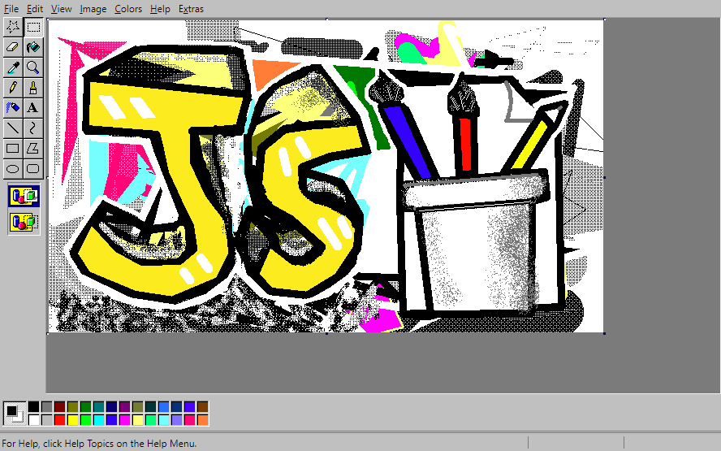

#Paint 😍
Windows 95, 98, and XP were the golden years of Paint. You had a tool box and a color box, a foreground color and a background color, and that was all you needed.


Just run the below Docker command to access the paint web application from **[My DockerHub Account](https://hub.docker.com/u/raam043)**
```sh
docker run --name paint -d -p 80:80 raam043/
